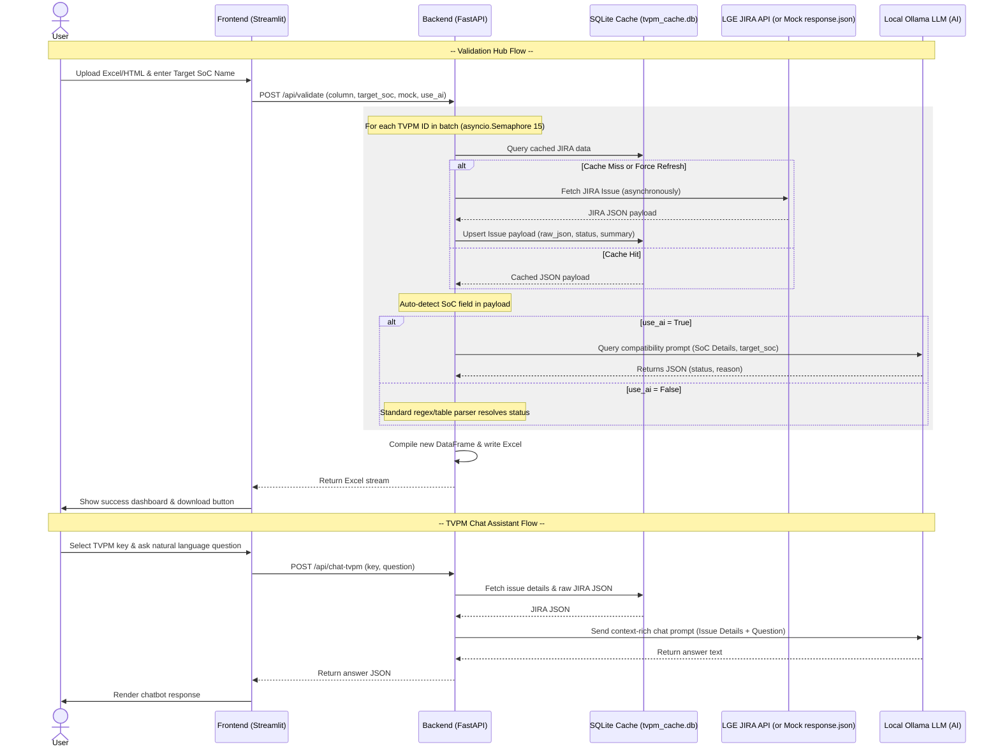

# TVPM Validation Tool: Feature Reference & Project Analysis Report

This document provides a comprehensive analysis of the **TVPM Validation Tool** codebase. It outlines the system architecture, details the local SQLite caching and Ollama AI integration, and walks through the feature workflows.

---

## 🏗️ System Architecture

The project is structured as a decoupled web application with a **FastAPI backend** (serving API requests) and a **Streamlit frontend** (interactive UI). It communicates with the internal LGE JIRA instance to validate issue applicability status based on SoC details.

To optimize performance and add intelligent reasoning capabilities, the system uses a **local SQLite cache** to avoid redundant JIRA API calls, and interfaces with a **local Ollama LLM** to analyze compatibility tables and support natural language queries.

---

## 📋 Detailed Feature Walkthrough

### 1. Excel & HTML Ingestion

- **Robust Ingestion (`load_excel_or_html`)**: LGE JIRA systems often export search results as HTML tables but save them with `.xls` or `.xlsx` extensions. The backend parses the file header. If it detects `<!doctype html`, `<html`, or `<table`, it decodes the content as UTF-8 and uses `pd.read_html`; otherwise, it defaults to standard `pd.read_excel`.

### 2. Dynamic Field Auto-Detection (Heuristics)

- **Heuristic Resolver (`auto_detect_soc_field`)**: Instead of forcing the user to manually configure JIRA custom fields, the backend automatically scans the issue payload for:
  - Any text field containing a JIRA table (delimited by `||` or `|`) with headers containing `"SOC"` or `"OS"`.
  - Any string field with exact values like `"O"`, `"X"`, or `"THE"`.
- If found, it automatically uses that field path (e.g. `fields.customfield_36507`) to extract compatibility details.

### 3. Local SQLite Caching

- **Cache Database (`tvpm_cache.db`)**: Stores fetched JIRA issue data locally in a `tvpm_issues` table containing:
  - `key` (TEXT Primary Key)
  - `summary` (TEXT)
  - `soc_details` (TEXT)
  - `status` (TEXT)
  - `raw_json` (TEXT - complete JIRA JSON response)
- This allows rapid local evaluation, offline mock mode operations, and feeds context into the AI Chat Assistant without making repetitive network calls.

### 4. Local AI Mapping & Reasoning (Ollama)

- **AI Compatibility Evaluation**: If "Use Local AI" is checked, the backend prompts the local Ollama LLM to parse the SoC compatibility details.
- Ollama evaluates whether the issue is applicable for the target SoC model and returns structured JSON containing:
  - `status`: Either `"Applicable"` or `"Not Applicable"`
  - `reason`: A brief, human-readable justification of the mapping decision (e.g., *"Model k24 is marked O in the compatibility table, meaning it is supported."*)
- This reasoning is appended as an extra **AI Reason** column in the Excel output.

### 5. Interactive TVPM Chat Assistant

- **Natural Language Assistant**: The user can select any cached TVPM key from a dropdown and ask natural language questions.
- The `/api/chat-tvpm` endpoint builds a context-rich prompt containing the issue's key, summary, description, and custom fields, and feeds it into the local Ollama model to generate context-specific, technically accurate answers.

### 6. Formatted Excel Export

- Generates a fresh `.xlsx` spreadsheet with standard columns:
  - `S.No`: Row serial number
  - `TVPM ID`: JIRA Issue Key
  - `SoC Details`: Raw value or extracted status from the table
  - `Status`: Evaluated status (`Applicable` / `Not Applicable` / `Error: 
`)
  - `AI Reason` (Optional): The explanation returned by Ollama
