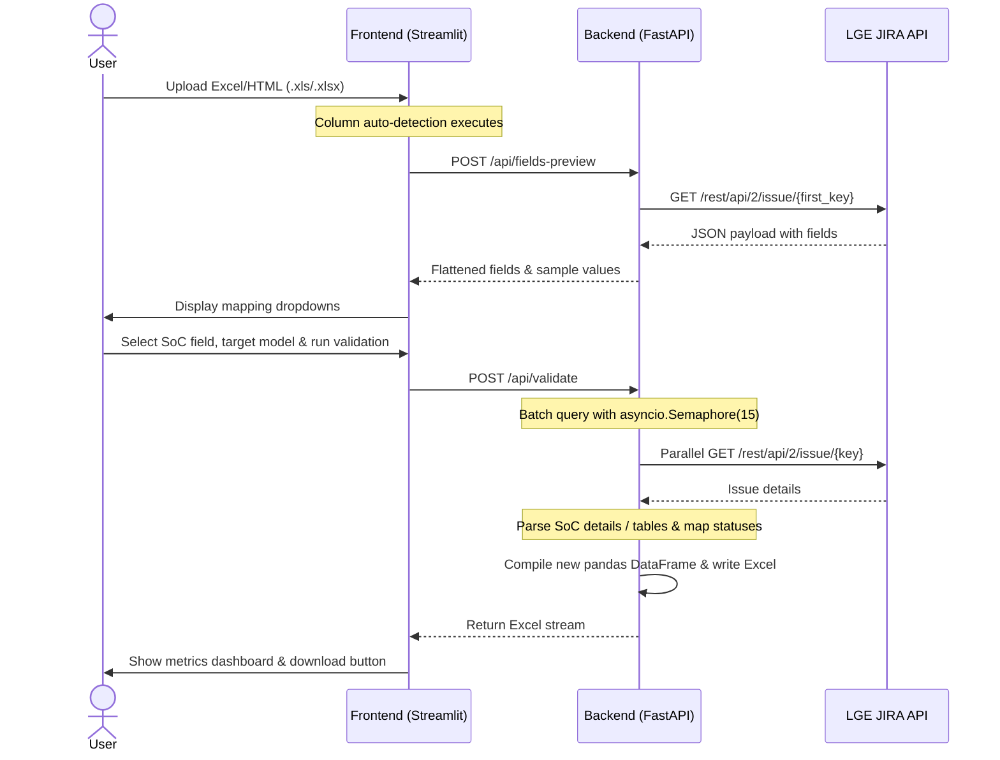

# TVPM Validation Tool: Feature Reference & Project Analysis Report

This document provides a comprehensive analysis of the **TVPM Validation Tool** codebase. It outlines the system architecture, explains feature workflows, highlights several critical bugs/gaps, and recommends actionable fixes.

---

## 🏗️ System Architecture

The project is structured as a decoupled web application with a **FastAPI backend** (serving API requests) and a **Streamlit frontend** (interactive UI). It communicates with the internal LGE JIRA instance to validate issue applicability status based on SoC details.

---

## 📋 Detailed Feature Walkthrough

### 1. Excel & HTML Ingestion
- **Robust Ingestion (`load_excel_or_html`)**: LGE JIRA systems often export search results as HTML tables but save them with `.xls` or `.xlsx` extensions. The backend parses the file header. If it detects `<!doctype html`, `<html`, or `<table`, it decodes the content as UTF-8 and uses `pd.read_html`; otherwise, it defaults to standard `pd.read_excel`.

### 2. Dynamic Field Discovery & Mapping
- **Preview Endpoint (`/api/fields-preview`)**:
  - Automatically reads the TVPM column, grabs the first valid issue ID, and queries LGE JIRA.
  - Recursively traverses and flattens all returned field paths (e.g., `fields.customfield_10100` or objects like `fields.priority.name`).
  - Sends fields and sample values back to the UI, enabling users to visually map which JIRA field holds the SoC compatibility matrix.

### 3. Asynchronous Concurrent Validation
- **FastAPI Batch Execution (`/api/validate`)**:
  - Utilizes `httpx.AsyncClient` alongside an `asyncio.Semaphore(15)` to process multiple issues concurrently while throttling requests to prevent JIRA API rate limits.
  - Dynamically extracts values using a custom dotted-path accessor (`get_nested_value`).

### 4. Advanced SoC Table Parsing & Status Mapping
- **Status Applicability Rules**:
  - `'X'` $\rightarrow$ **Not Applicable**
  - `'O'` / `'THE'` / `'the'` $\rightarrow$ **Applicable**
  - Any other value $\rightarrow$ **Not Applicable** (Default fallback)
- **Table Parsing (`extract_status_from_jira_table`)**:
  - If a JIRA field contains a structured table string (e.g., `||OS||SOC||Year|| ||\n|webOS26|o26|Y-2026|THE|`), and a target SoC model is specified, the system:
    1. Identifies the column indices for "SOC" and the status (last column).
    2. Scans each row matching the target SoC model.
    3. Extracts and maps the row-specific status (e.g., `THE` $\rightarrow$ `Applicable`).

### 5. Formatted Excel Export
- Generates a fresh `.xlsx` spreadsheet with standard columns:
  - `S.No`: Row serial number
  - `TVPM ID`: JIRA Issue Key
  - `SoC Details`: Raw value or extracted status from the table
  - `Status`: Evaluated status (`Applicable` / `Not Applicable` / `Error: 
`)

---